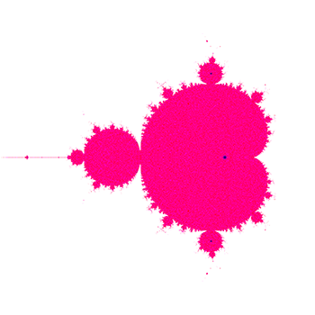

# Mandelbrot Fractal

This is a super basic python script that renders the Mandelbrot set on the Complex plane. I had a lot of other things to do including watching lectures and reading the required readings, but I got too distracted by a sudden intense desire to plot fractals.

## How do I use it?

The `resolution` and `quality` variables at the top of `main.py` are the configuration options.

With those set to desired values, simply run `python3 main.py`. The script will run, and show the generated image on your screen.

## License

This script is licensed under the WTFPL. For full text, see [the LICENSE document](LICENSE.md).
